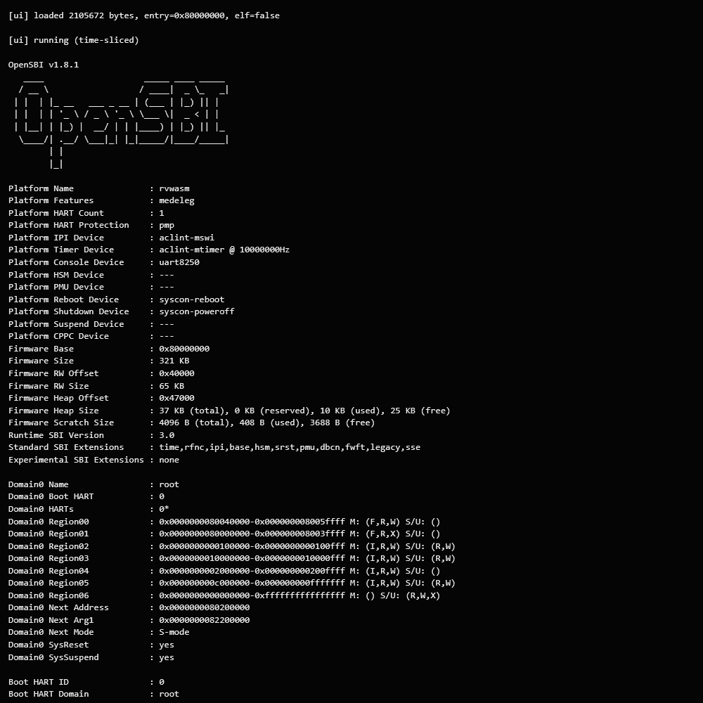

# rvwasm

[](https://github.com/kitaharata/rvwasm/blob/main/LICENSE)
[](https://github.com/kitaharata/rvwasm/releases)

[English](../README.md) | [Español](README-ES.md) | [Français](README-FR.md) | [Português](README-PT.md) | [Deutsch](README-DE.md) | [Italiano](README-IT.md) | [简体中文](README-ZH-CN.md) | [繁體中文](README-ZH-TW.md) | [日本語](README-JA.md) | [한국어](README-KO.md)

## Aperçu

Un émulateur RV64IMAC tournant sur Go 1.23.2 `GOOS=js GOARCH=wasm`. La configuration par défaut est un seul hart, mais un ordonnancement coopératif de 1 à 8 harts est disponible depuis l'interface utilisateur (UI). Vous pouvez charger OpenSBI 1.8.1 `fw_payload.bin`/`fw_jump.bin`/`fw_dynamic.bin`/ELF depuis l'UI du navigateur pour confirmer le démarrage.

[](https://kitaharata.github.io/rvwasm/)

OpenSBI 1.8.1 `fw_payload.bin` démarrant sur rvwasm et entrant dans le payload de mode S de l'étape suivante.

## Fonctionnalités implémentées

- Instructions de base RV64I
- Extension M
- Implémentation minimale de LR/SC/AMO de l'extension A
- Instructions entières communes de l'extension C
- Équivalents Zicsr/Zifencei
- Implémentation minimale du mode de privilège M/S/U CSR/trap/mret/sret
  - Corrige l'exception synchrone `mepc`/`sepc` au PC de l'instruction défaillante
  - Corrige la charge/écriture CSR défaillante afin de ne pas corromper rd et arrête l'avance du compteur de retraits
  - Vérification de l'existence de CSR, suppression des effets secondaires de l'écriture de CSR en lecture seule, reflet de base de `mcounteren`/`scounteren`
  - Stubs de CSR `senvcfg`/activation d'état ajoutés pour les sondages Linux
  - Reflet de base de `TVM`/`TW`/`TSR` et effacement de `MPRV`
- MMU Sv39
  - Mode `satp` Bare/Sv39
  - Parcours de table de pages à 3 niveaux
  - Feuilles de 4 KiB/2 MiB/1 GiB
  - Reflet de base de `SUM`/`MXR`/`MPRV`
  - Exception de défaut de page (page fault exception)
  - Mise à jour automatique des bits `A`/`D` de PTE
- MMIO de type UART 16550 (`0x10000000`)
  - Sortie depuis l'invité
  - Injection d'entrée depuis l'UI du navigateur
  - Interruption de réception
- mtime/mtimecmp/msip de type CLINT (`0x02000000`)
  - Routage MSIP/MTIMECMP par hart pour les configurations multi-hart
- Contrôleur d'interruptions de type PLIC (`0x0c000000`)
  - priority/pending/enable/threshold
  - claim/complete
  - Contexte M/S par hart
- Application de PMP
  - TOR/NA4/NAPOT
  - Autorisations R/W/X
  - Restrictions du mode M via des entrées verrouillées
- Informations de démarrage OpenSBI `fw_dynamic`
  - Les informations dynamiques sont placées à `0x87dff000`
  - Le pointeur d'informations dynamiques est défini sur `a2`
  - Le payload de mode S / noyau peut être chargé séparément depuis l'UI
- Périphérique bloc virtio-mmio (`0x10001000`)
  - Registres MMIO modernes de type virtio 1.0
  - Prise en charge minimale pour la lecture/écriture/flush/get-id de virtqueue divisée
  - Négociation de `FEATURES_OK` et vérification de `VIRTIO_F_VERSION_1`
  - Réinitialisation de la file d'attente, ignore notify avant `DRIVER_OK`, reflet de base de l'indicateur `NO_INTERRUPT`
  - Gestion de `VIRTIO_RING_F_INDIRECT_DESC` et tables de descripteurs indirects
  - Suppression d'interruption via l'événement utilisé `VIRTIO_RING_F_EVENT_IDX`
  - Les images de disque peuvent être chargées depuis l'UI
  - Les images de disque modifiées par l'invité peuvent être téléchargées depuis l'UI
- Périphérique console virtio-mmio (`0x10002000`)
  - Console minimale avec ID de périphérique 3
  - File d'attente 0 réception / File d'attente 1 transmission
  - Prise en charge minimale pour `VIRTIO_CONSOLE_F_SIZE`, les descripteurs indirects et les index d'événements
  - Injecte l'entrée de l'UI à la fois vers UART et virtio-console
- Périphérique réseau virtio-mmio (`0x10003000`)
  - virtio-net de débogage minimal avec ID de périphérique 1
  - File d'attente 0 réception / File d'attente 1 transmission
  - Prise en charge minimale pour `VIRTIO_NET_F_MAC`/`VIRTIO_NET_F_STATUS` / descripteurs indirects / index d'événements
  - Injecte l'hexadécimal de trames Ethernet dans RX depuis l'UI
  - Affiche les trames Ethernet envoyées par l'invité en tant que journaux TX
- Périphérique rng virtio-mmio (`0x10004000`)
  - Source d'entropie minimale avec ID de périphérique 4
  - Prise en charge minimale pour les virtqueues divisées, les descripteurs indirects et les index d'événements
  - Une graine déterministe peut être définie depuis l'UI
- Périphérique d'entrée virtio-mmio (`0x10005000`)
  - Clavier/périphérique d'entrée de débogage minimal avec ID de périphérique 18
  - Prise en charge minimale pour la file d'attente d'événements / file d'attente d'état, les descripteurs indirects et les index d'événements
  - Les événements de touche / événements d'entrée bruts peuvent être injectés depuis l'UI
- Périphérique gpu virtio-mmio (`0x10006000`)
  - Base minimale de virtio-gpu 2D pour le débogage avec ID de périphérique 16
  - Prise en charge minimale pour les files d'attente de contrôle / curseur, les descripteurs indirects et les index d'événements
  - Réponses de base pour `GET_DISPLAY_INFO`/`RESOURCE_CREATE_2D`/`SET_SCANOUT`/`FLUSH`, etc.
  - Utile pour observer les sondages virtio-gpu de Linux et les commandes initiales de modeset
- Passage d'initrd/initramfs
  - Adresse de chargement par défaut : `0x84000000`
  - Reflété dans `/chosen/linux,initrd-start` / `/chosen/linux,initrd-end` du DTB généré automatiquement
- Édition des bootargs
  - Par défaut : `console=ttyS0 earlycon=sbi root=/dev/vda rw`
  - Préréglages pour UART / virtio-console / initramfs / débogage détaillé
  - Peut être configuré depuis l'UI et reflété dans le DTB généré automatiquement
- Tampon circulaire de trace d'exécution
  - PC/instructions/traps/dernière cause de trap/tval peuvent être visualisés dans l'UI
  - Des exportations Texte/JSON/CSV des vidages CSR et des captures de traces de hart entières sont disponibles depuis l'UI
  - Diagnostics affichant les derniers arguments ECALL/SBI, les compteurs SBI BASE/TIME/IPI/RFENCE/HSM/SRST/hérités, les traps et les états des files d'attente virtio en un coup d'œil
  - Exportation JSON des diagnostics / états des périphériques
  - Charge les symboles ELF / System.map, affiche les symboles autour du PC arrêté, recherche de noms et résolution automatique des symboles PC dans les journaux de panic/oops
  - Shim SBI arbitraire pour tester directement de petits payloads de mode S sans OpenSBI
    - Court-circuit minimal de BASE / TIME / IPI / RFENCE / HSM / SRST
    - Chemin de débogage vers l'entrée en mode S du hart cible via HSM `hart_start`
    - Désactivé par défaut. Non utilisé dans le chemin normal pour exécuter OpenSBI
  - Des plages de mémoire physique arbitraires peuvent être vidées depuis l'UI
  - Des points d'arrêt de PC, des points d'observation de lecture/écriture physique et des filtres de trace peuvent être définis depuis l'UI
  - Les points d'arrêt peuvent spécifier des nombres d'occurrences, des conditions de mode et des conditions de hart
  - La trace affiche des mnémoniques de décodage simplifiés ainsi que des instructions brutes
  - Les occurrences de point d'arrêt / point d'observation enregistrent la raison de l'arrêt dans les exportations d'état / diagnostics / traces
  - Collecte des histogrammes d'accès MMIO/DRAM, vous permettant de vérifier les biais dans les sondages de périphériques et les activités de file d'attente via Diagnostics / JSON
  - Enregistre les chronologies d'accès MMIO/DRAM dans le tampon circulaire, vous permettant de vérifier la série chronologique des sondages dans des vues brutes / compactes
  - La chronologie d'accès MMIO ajoute les noms de décodeurs de registres pour virtio-mmio / UART / CLINT / PLIC, permettant l'observation dans des unités telles que `QueueNotify` / `Status` / `LSR`
  - Active facultativement la trace d'accès CSR pour afficher les queues de lecture/écriture CSR de l'invité et les résumés de lecture/écriture par CSR dans Diagnostics / exportations de trace
  - Active facultativement le profil des points chauds du PC pour afficher les PC fréquemment exécutés avec des symboles avant l'arrêt
  - La capture / différence d'instantanés de diagnostic vous permet de vérifier les différences dans les états de hart/périphérique/CSR/MMIO avant et après l'exécution sur l'UI
  - Plie les instructions, traps et journaux ECALL identiques et consécutifs dans la vue de trace compacte
  - Le lanceur de test de fumée (smoke runner) par préréglage de démarrage peut exécuter automatiquement un nombre spécifié d'étapes de hart du firmware/payload actuellement chargé et récupérer les résultats JSON
  - L'analyseur de phase de démarrage peut résumer conjointement les activités d'OpenSBI / Linux / panic / virtio / traps / symboles de PC
  - La chronologie de démarrage peut afficher des marqueurs de console et des sondages MMIO / états / QueueNotifies / réclamations PLIC intégrés dans une série chronologique
  - L'analyseur de sondages de périphériques peut agréger les lectures/écritures, les registres d'identité, les négociations d'état et les notifications de file d'attente virtio/UART/PLIC/CLINT
  - L'inspecteur de virtqueue peut afficher les derniers états de QueueSel/QueueNum/Desc/Driver/Device/QueueReady/QueueNotify par périphérique/file d'attente
  - Le visualiseur de chaîne de descripteurs trace les descripteurs de tête à partir de l'anneau disponible et affiche les descripteurs NEXT / WRITE / INDIRECT avec un petit aperçu du tampon
  - L'exportation de graphe de chaîne de descripteurs peut enregistrer et visualiser les chaînes de virtqueue en tant que DOTs Graphviz
  - Le scanner de mémoire physique de l'invité peut détecter des zones dans la DRAM ressemblant aux magies ELF / FDT / gzip / xz / zstd / squashfs / cpio / ext / version d'OpenSBI / Linux / BusyBox / ligne de commande du noyau
  - Le classificateur de sondages de pilotes / initcall peut catégoriser les lignes de journal de la console Linux liées aux initcalls, sondages, virtio, stockage, consoles, réseaux et graphiques
  - La chronologie d'initcall peut afficher les lignes d'initcall / sondages de pilotes classifiées dans des groupes de séries chronologiques
  - Lit les tables de lignes DWARF à partir d'ELFs avec des symboles, affichant fichier:ligne près du PC actuel, les résumés de fichiers DWARF et les annotations de symbole+ligne pour les PC de trace
  - Le résumé de panique extrait automatiquement les lignes autour de panic/oops/défaut dans le journal de la console et résout les adresses avec les symboles chargés
  - Le JSON d'analyse de démarrage peut exporter collectivement des chronologies / sondages de périphériques / virtqueues / résumés de panique
  - Le rapport de relecture de trace peut résumer le nombre d'étapes/traps/ecalls/shims SBI, les mnémoniques chauds et les causes de trap dans la trace
  - La comparaison de base de trace peut comparer les différences de PC/instruction/trap entre une trace précédemment enregistrée et la trace actuelle depuis le début
  - La base de trace peut être enregistrée/chargée vers/depuis le localStorage du navigateur
  - Le rapport/JSON de régression de démarrage, ainsi que les exportations de rapports Markdown/HTML, peuvent enregistrer en masse les statistiques de trace, les événements de démarrage, les sondages de périphériques, les virtqueues, les objets mémoire et les nombres d'initcalls
  - L'instantané de virtqueue peut afficher les configurations de files d'attente et les chaînes de descripteurs simultanément
  - Le détecteur d'anomalies de virtqueue peut détecter les adresses de file d'attente prête manquantes, les boucles de descripteurs, les longueurs indirectes non valides, les tampons hors de la DRAM, etc.
  - Les indices d'anomalies de virtqueue peuvent afficher des suggestions de réparation telles que QueueNum / QueueDesc / QueueReady / alignement des descripteurs pour chaque résultat de détection
  - La requête de diagnostic intégrée peut effectuer des recherches croisées dans les consoles / traces / traces CSR / chronologies MMIO / anomalies de virtqueue / index de mémoire en utilisant la même requête
  - Les préréglages de requêtes de diagnostic permettent la recherche par lots pour les paniques, les négociations virtio, QueueReady/Notifies, satp/mstatus, les traps et les rootfs
  - Le rapport de partage MD/JSON/HTML permet de partager les régressions de démarrage, les indices/triage de virtqueue, les index de mémoire, les préréglages de requêtes, les indices de saut et les résultats de requêtes dans un format autonome
  - Le tableau de bord de triage / classement des causes d'arrêt peut afficher les paniques, les traps, les défauts de page/d'accès, les anomalies de virtqueue et les sondages de périphériques bloqués par ordre de candidat
  - La preuve de cause d'arrêt affiche les justifications de classement, les répartitions des scores, les requêtes de diagnostic recommandées et les prochaines actions
  - La base du tableau de bord de triage peut être enregistrée dans le localStorage pour comparer les nombres d'états/phases/périphériques/anomalies/mémoires avec le tableau de bord actuel
  - La base des préréglages de diagnostic peut être enregistrée dans le localStorage pour comparer la différence avec le nombre d'occurrences du préréglage actuel
  - Le rapport de partage expurgé MD/JSON/HTML peut générer des rapports partageables avec les adresses IP/MAC/e-mails expurgés
  - Les options d'expurgation JSON permettent d'activer/désactiver le remplacement des IP/MAC/e-mails/longues adresses hexadécimales depuis l'UI
  - Le vidage d'objets mémoire peut vérifier l'hexadécimal + ASCII autour des correspondances d'index de mémoire/recherche
  - Le vidage de plage de mémoire peut spécifier une adresse DRAM arbitraire et une longueur d'octets pour un vidage hexadécimal + ASCII / exporter en JSON
  - La capture / différence de balayage de mémoire peut vérifier les candidats de fragments ELF/FDT/initrd/rootfs qui ont augmenté/diminué avant et après l'exécution
  - L'index de mémoire peut regrouper les signatures proches d'ELF/FDT/initrd/noyau/rootfs par plage pour créer un index
  - Extrait les journaux de type `dmesg` Linux des sorties UART / virtio-console et résout les adresses de panic/oops avec les symboles chargés
- simple-framebuffer
  - Ajoute automatiquement `0x86000000`, 1024x768, `a8r8g8b8` à `/chosen/framebuffer@86000000` dans le DTB généré
  - Dessine le framebuffer sur un Canvas de l'UI, et des vidages bruts RGBA / PNG peuvent être téléchargés
  - Le support de ressource 2D pour virtio-gpu peut être copié vers le simple-framebuffer lors de `TRANSFER_TO_HOST_2D` / `RESOURCE_FLUSH`
- DRAM `0x80000000`, 128 MiB
- Génération automatique de DTB virt minimal avec virtio-blk / virtio-console / virtio-net / virtio-rng / virtio-input / virtio-gpu / UART / PLIC / CLINT, ou chargement de DTB depuis l'UI
  - Compatibilité `sifive,plic-1.0.0` / `sifive,clint0` et `dma-coherent` virtio ajoutée
  - Génère `cpu@N` et `interrupts-extended` en fonction du nombre de harts

## Utilisation

```bash
make serve
```

Ouvrez `http://localhost:8080` dans votre navigateur, sélectionnez le firmware OpenSBI, puis cliquez sur `Load firmware` → `Run`.

Si vous souhaitez tester virtio-console comme console Linux, vous pouvez modifier les bootargs par quelque chose comme `console=hvc0 earlycon=sbi root=/dev/vda rw`. Par défaut, il utilise UART (`ttyS0`) comme d'habitude.

Pour analyser un PC arrêté, chargez un `System.map` Linux ou un ELF avec des symboles en utilisant `Load symbols`, puis utilisez `Symbols @ PC` / `Diagnostics` / `Search symbols`. Si l'ELF avec des symboles contient des tables de lignes DWARF, vous pouvez également vérifier fichier:ligne en utilisant `DWARF lines @ PC`. `DWARF file summary` indique le nombre de lignes par fichier contenu dans la table de lignes. Si le firmware/payload est un ELF avec des symboles, il importe automatiquement la table de symboles. `Annotated trace` annote `pc=` dans la trace avec des symboles/lignes DWARF. `Download trace` enregistre un instantané de la trace pour tous les harts. Vous pouvez également sélectionner les formats JSON/CSV. La trace JSON inclut les informations de symbole/source si des symboles existent. Entrez des chaînes telles que `trap`, `ecall`, `sbi-shim`, `pc=`, ou `virtio` dans `Trace filter` pour affiner la queue/exportation de trace, la chronologie d'accès et la vue compacte. `Compact trace` plie les instructions, traps et ECALLs identiques et consécutifs. Si vous collez un journal panic/oops et cliquez sur `Analyze log symbols`, il résout les adresses de type PC 64 bits dans le journal à l'aide des symboles chargés.

`Trace replay report` génère des statistiques pour la trace actuelle, et `Trace baseline compare` colle une trace enregistrée pour comparer les différences de PC/instruction/trap avec la trace actuelle depuis le début. `Save current trace as baseline` / `Load saved baseline` conserve la base dans le localStorage du navigateur. `Boot regression` / `Boot regression JSON` / `Boot regression MD` / `Boot regression HTML` sont des rapports de vérification de régression qui consolident la chronologie de démarrage, les sondages de périphériques, les virtqueues, le scanner de mémoire, la classification initcall et les statistiques de trace. Vous pouvez également vérifier l'augmentation ou la diminution des candidats ELF/FDT/initrd/rootfs dans la mémoire de l'invité en faisant `Capture memory scan` → Run → `Diff memory scan`. `DWARF source context` affiche conjointement les symboles et le fichier:ligne DWARF autour du PC actuel.

`Boot phase` résume la progression actuelle à partir des journaux de console, des histogrammes MMIO, des traps et des informations de symboles. `Boot timeline` aligne les jalons de la console et les sondages MMIO / états / QueueNotifies dans une série chronologique. `Device probe` agrège les accès aux registres et les négociations de virtio et autres, et `Virtqueue inspect` affiche les configurations de file d'attente et les états de notification par périphérique/file d'attente. `Descriptor chains` lit les chaînes de descripteurs à partir de l'anneau disponible de la file d'attente et affiche les descripteurs indirects et les aperçus de tampon. `Descriptor DOT` / `Download DOT` exporte la même chaîne en tant que Graphviz DOT. `Virtqueue anomalies` détecte les incohérences dans les configurations de files d'attente et les chaînes de descripteurs, et `Anomaly hints` affiche le prochain point de contrôle pour chaque incohérence. `Integrated diagnostic query` effectue des recherches croisées dans les consoles / traces / traces CSR / chronologies MMIO / anomalies de virtqueue / index de mémoire en utilisant des mots tels que `virtio QueueReady`, `panic`, `satp`, `0x80200000`. `Share report MD/JSON/HTML` est un bundle partageable ajoutant des indices/triage d'anomalies, des index de mémoire, des indices de sauts de mémoire, des préréglages de requêtes et des correspondances de requêtes au rapport de régression de démarrage. Le format HTML peut être enregistré sous forme de fichier autonome avec du JSON intégré. `Diagnostic query presets` regroupe les recherches liées aux paniques, aux états virtio, QueueReady/QueueNotify, satp/mstatus, aux traps et aux rootfs. `Save query` / `Load query` enregistre les requêtes de diagnostic dans le localStorage du navigateur. `Memory scan` recherche des candidats de fragments ELF/FDT/initrd/noyau/rootfs dans la DRAM, et `Memory index` regroupe les signatures proches par plage. `Memory search` recherche dans les index de mémoire à l'aide de chaînes ou d'adresses `0x...`, et `Memory jumps` affiche des candidats de destination de saut utiles tels que ELF/FDT/Linux/OpenSBI/cmdline/rootfs. `Initcall classifier` / `Initcall timeline` classifie et horodate les journaux de style initcall/sondage de pilote Linux. `Panic summary` extrait les lignes autour des paniques/oops/défauts et résout les adresses si des symboles sont présents. `Boot analysis JSON` les enregistre ensemble. `Dmesg extract` extrait uniquement les lignes de style Linux des sorties UART / virtio-console. `Decoded MMIO` affiche les derniers accès MMIO avec les noms des registres.

`Triage dashboard` combine les classements des causes d'arrêt, la gravité des anomalies de virtqueue, les sondages de périphériques et les signets de requête dans un texte sur un seul écran. `Stop-cause ranking` hiérarchise les paniques du noyau, les oops, les instructions illégales, les défauts de page/d'accès, les anomalies de virtqueue et les sondages de périphériques bloqués à partir des consoles/traces/états. `Stop-cause evidence` affiche la justification du classement, la répartition du score, les requêtes recommandées et les prochains points de contrôle. Vous pouvez comparer les différences dans les nombres d'états/phases/périphériques/anomalies/mémoires sur le tableau de bord en faisant `Save triage baseline` → Run → `Triage diff`. `Save preset baseline` → Run → `Compare preset baseline` vous permet de vérifier si le nombre de correspondances de requêtes prédéfinies comme panic/virtio/satp/rootfs a augmenté ou diminué depuis la dernière fois. `Memory dump hits` vide en hexadécimal/ASCII autour des correspondances de l'index de mémoire à l'aide de requêtes de diagnostic ou de filtres de trace. `Memory range dump` spécifie une adresse/longueur arbitraire pour vider directement la DRAM en hexadécimal/ASCII. `Redacted share MD/JSON/HTML` remplace les e-mails / MACs / IPv4s par `<email>` / `<mac>` / `<ipv4>` avant le partage. `Redaction options JSON` active/désactive `replace_ips` / `replace_macs` / `replace_emails` / `replace_long_hex`.

`Smoke preset` réinitialise le préréglage de démarrage actuellement sélectionné et n'exécute que les étapes spécifiées. `Smoke matrix` exécute séquentiellement une liste de préréglages tels que `uart-blk,hvc-blk,uart-initrd,hvc-initrd,simplefb` et répertorie les étapes d'exécution, la dernière phase et les candidats de cause d'arrêt pour chaque préréglage.

Les points d'arrêt du PC sont ajoutés en saisissant la valeur hexadécimale d'un PC physique/virtuel dans le champ `PC breakpoint` sous `Breakpoints / watchpoints`. `Run` / `Step 1k` s'arrête à un point d'arrêt, et `Step` avance d'exactement 1 instruction même si le PC actuel est un point d'arrêt. Les points d'observation d'écriture détectent les écritures du bus vers une plage d'adresses physiques, et les points d'observation de lecture sont une fonctionnalité simple pour détecter les lectures du bus. Ils sont utiles pour vérifier les sondages MMIO, les écritures du framebuffer et les références à des structures spécifiques. `Access timeline` / `Compact access` affiche les accès récents à la DRAM/MMIO dans une série chronologique compressée. `PC profile on` agrège les PC chauds, et `Capture snapshot` → Run → `Diff snapshot` permet de vérifier les différences de diagnostic avant et après l'exécution.

simple-framebuffer prépare une mémoire de 1024x768x32bpp à `0x86000000` et la place en tant que `simple-framebuffer` dans `/chosen/framebuffer@86000000` du DTB généré automatiquement. Si simplefb est utilisable côté Linux, il peut être affiché sur le Canvas avec `Render framebuffer`.

virtio-net ne se connecte pas à un réseau réel depuis le navigateur ; c'est un périphérique de débogage au niveau des paquets. Entrez l'hexadécimal de la trame Ethernet dans `virtio-net debug` pour l'injecter dans RX, et les trames envoyées par l'invité à la file d'attente TX peuvent être vérifiées dans `Show TX frames`. Pour qu'il soit reconnu du côté Linux, exécutez des commandes comme `ip link set dev eth0 up` du côté de l'invité si nécessaire.

virtio-rng est un périphérique de vérification présentant un PRNG déterministe comme source d'entropie invité. Pour maintenir la reproductibilité, la graine par défaut est fixe et peut être modifiée via `Set deterministic seed` dans l'UI.

virtio-gpu est un périphérique minimal pour observer les sondages du pilote virtio-gpu de Linux et la configuration des ressources 2D. Au lieu d'une véritable accélération GPU, il suit les commandes modeset / scanout / flush arrivant dans la file d'attente de contrôle et transmet les états aux Diagnostics. Parce qu'il copie également depuis la mémoire de sauvegarde des ressources vers le simple-framebuffer, vous pouvez vérifier le résultat de l'invité vidant une ressource 2D via `Render framebuffer` / exportation PNG. `UPDATE_CURSOR` / `MOVE_CURSOR` dans la file d'attente du curseur sont également enregistrés comme états.

`SBI shim on` sert au débogage direct des payloads de mode S sans OpenSBI. Laissez-le désactivé pour les expériences normales utilisant `fw_dynamic.bin` / `fw_payload.bin`.

Si vous souhaitez tester Multi-hart, veuillez définir le `Hart count` avant de charger le firmware. Étant donné que la modification des paramètres implique une réinitialisation de la machine, cela suppose que vous rechargerez le firmware / payload / disque par la suite. `View hart` permet de basculer les registres / CSRs / traces du hart cible affiché.

Lors de l'utilisation de `fw_dynamic.bin`, chargez le payload de mode S / noyau autour de `0x80200000` via `Load payload` si nécessaire. L'émulateur place des informations dynamiques à `0x87dff000` et définit son adresse sur `a2`.

Pour les expériences Linux, vous pouvez utiliser l'un des éléments suivants :

- `Load disk` : Passez une image disque brute comme rootfs en tant que virtio-blk. Les bootargs par défaut sont `root=/dev/vda rw`.
- `Load initrd` : Placez initramfs à `0x84000000` et reflétez la plage initrd dans le DTB généré. Modifiez les bootargs par `console=ttyS0 earlycon=sbi root=/dev/ram0 rw` etc., si nécessaire.

Exemple utilisant les binaires RISC-V pré-distribués d'OpenSBI 1.8.1 :

```bash
curl -LO https://github.com/riscv-software-src/opensbi/releases/download/v1.8.1/opensbi-1.8.1-rv-bin.tar.xz
tar -xf opensbi-1.8.1-rv-bin.tar.xz
# Chargez fw_dynamic.bin / fw_payload.bin / fw_jump.bin à partir des fichiers extraits via le navigateur
```

Si vous compilez OpenSBI localement, préparez une chaîne d'outils RISC-V telle que `riscv64-unknown-elf-` et compilez avec `PLATFORM=generic`.

### Commandes de développement

```bash
go test ./...
make wasm
make serve
```

## Remarque

Cette implémentation intègre progressivement les fonctions nécessaires pour étudier l'initialisation d'OpenSBI, la transition de payload en mode S et le démarrage de Linux. Pour le démarrage de Linux, ont été ajoutés : PMP, Sv39, virtio-blk, virtio-console, virtio-net, virtio-rng, virtio-input, virtio-gpu, initrd, simple-framebuffer, précision de trap/CSR, trace/résumé CSR, histogramme/chronologie MMIO/décodeurs de registres, analyseur de phase/chronologie de démarrage, analyseur de sondage de périphérique, inspecteur de virtqueue/visualiseur de chaîne de descripteurs/exportation DOT/instantané/détecteur d'anomalies/indices d'anomalies/triage d'anomalies, scanner de mémoire invité/index/diff/recherche/indices de saut/aides au vidage, requête de diagnostic intégrée/préréglages de requête/comparaison de base de préréglages, tableau de bord de triage/classement de cause d'arrêt, bundle de rapport de partage/HTML/expurgation, classificateur/chronologie initcall, recherche de ligne DWARF/contexte source/annotation de trace, résumé de panique, extracteur dmesg, relecture/comparaison de trace, rapports de régression de démarrage, profilage PC, différence d'instantané, lanceur de test de fumée de démarrage/matrice de fumée, différence de base de triage, preuve de cause d'arrêt, expurgation modifiable et vidage de plage de mémoire. Les principales parties non implémentées ou simplifiées comprennent un modèle précis de cycle/temps, AIA/IMSIC, une véritable connexion réseau via des ponts tap/WebSocket, une accélération complète virgl/DRM/GPU, des comportements stricts WARL/WPRI pour tous les CSR et une véritable exécution parallèle utilisant plusieurs workers. Multi-hart est un ordonnancement coopératif au sein d'un seul worker wasm.

## Diagnostics et aides à la régression

Partage amélioré pour les matrices de test de fumée et les requêtes de diagnostic.

- `Smoke matrix MD/HTML` enregistre les résultats de la matrice de fumée sous forme de Markdown / HTML autonome.
- `Save smoke baseline` → Run → `Compare smoke baseline` vous permet de vérifier les différences de phase, les étapes d'exécution et les principales causes d'arrêt pour chaque préréglage.
- `Stop checklist` crée une liste de contrôle d'éléments d'action spécifiques à vérifier ensuite en fonction du classement des causes d'arrêt.
- `CSR/MMIO bookmarks` extrait uniquement les correspondances cruciales de CSR / MMIO / trace des résultats de la requête de diagnostic intégrée.
- `Watchpoint hits` affiche l'historique des occurrences de points d'observation de lecture/écriture dans une série chronologique. `Clear hit timeline` efface uniquement l'historique.
- `Artifact manifest` répertorie les firmware / payload / disque / initrd / symboles actuellement chargés et les plages, entrées et hachages SHA-256 des informations dynamiques / DTB générés.

### Aides au transfert de régression

- `Manifest diff` / `Manifest diff JSON` compare le manifeste d'artefact de démarrage actuel avec une base enregistrée dans le localStorage et affiche les différences dans les bootargs, les nombres de harts, les plages de charge, les entrées, la détection ELF et les hachages SHA-256.
- `Auto break/watch suggestions` génère des candidats pour les points d'arrêt PC / points d'observation de lecture / points d'observation d'écriture à définir pour la prochaine exécution en fonction de la preuve de cause d'arrêt, des PC de trace récents et des chronologies d'occurrences de points d'observation.
- `Smoke clusters` / `Smoke clusters JSON` regroupe les résultats de préréglage de matrice de fumée par phase et cause d'arrêt principale, en regroupant les préréglages présentant le même type d'échec.
- `Diagnostic bundle JSON` est un JSON autonome regroupant le manifeste, le tableau de bord de triage, les causes d'arrêt, les suggestions de points d'arrêt, le bundle de partage et les occurrences de points d'observation.
- `Compressed bundle JSON` est le bundle de diagnostic ci-dessus converti en gzip+base64. Utilisez-le lorsque vous souhaitez réduire la taille avant de le coller dans des problèmes ou des discussions.

### Aides au transfert / provenance

- `Decode bundle` extrait un `Diagnostic bundle JSON` ou un `Compressed bundle JSON` collé, ou un gzip+base64 brut.
- `Bundle compare` / `Bundle compare JSON` compare un bundle passé collé avec le bundle actuel et affiche les différences dans les phases de triage, les causes d'arrêt principales, les manifestes, les hachages d'artefacts, les clusters de fumée, les occurrences de points d'observation et les nombres de suggestions.
- `Provenance` / `Provenance JSON` résume les hachages SHA-256 du manifeste, de la trace, de la console et du bundle de diagnostic, le nombre de lignes de trace, le nombre d'octets de la console et les principales causes d'arrêt. Peut être utilisé pour vérifier la reproductibilité ou comme preuve jointe aux problèmes.
- `Handoff MD` résume la provenance, les principales causes d'arrêt, les suggestions automatiques de points d'arrêt/d'observation, les listes de contrôle d'arrêt, les différences de base et les manifestes d'artefacts en Markdown.
- `Apply auto breaks` applique en masse les meilleurs candidats des suggestions automatiques de points d'arrêt/d'observation à l'émulateur actuel. Un utilitaire pour configurer rapidement des positions d'arrêt ou des plages suspectes de MMIO/DRAM avant la réexécution.

### Reproduction / Signature / Transfert Headless

- `Repro plan` / `Repro MD` / `Repro JSON`
  - Génère des étapes de reproduction à partir de bundles de diagnostic, de provenance et de manifestes d'artefacts.
  - Répertorie les rôles, les tailles, les plages de charge et les hachages SHA-256 du firmware / payload / initrd / disque / symboles en tant qu'épingles d'artefact.
  - Documente les préréglages de fumée, les bootargs, les nombres de harts, next_addr et les conditions d'arrêt/d'observation recommandées en étapes.
- `Log signature` / `Log signature JSON`
  - Crée un résumé léger à partir des hachages SHA-256 des traces / consoles / manifestes, du nombre de lignes de trace, des premiers/derniers PC, des premières/dernières lignes de console et des jetons fréquents.
  - Vous permet de comparer « Est-ce le même journal ? » ou « Qu'est-ce qui a changé ? » sans coller de traces brutes.
- `Save log signature` / `Load log signature` / `Compare log signature`
  - Enregistre la base de la signature du journal dans le localStorage du navigateur et la compare avec la signature actuelle.
  - Affiche les différences dans les hachages de trace, les hachages de console, les hachages de manifeste, le nombre de lignes, les derniers PC et les dernières lignes de console.
- `Auto break verify`
  - Affiche un résumé de confirmation avant d'appliquer les suggestions automatiques de points d'arrêt/d'observation.
  - Émet des avertissements pour les suggestions en double ou les plages de PC suspectes.
- `Headless smoke script`
  - Génère un squelette de script shell pour CI/transfert à partir du manifeste d'artefact actuel, des bootargs, des nombres de harts, des préréglages de fumée et des nombres d'étapes.
  - Conçu pour corriger les épingles d'artefacts et les matrices de préréglages avant d'ajouter des harnais de navigateur comme Playwright à l'environnement d'exécution.

#### Aides Headless / CI

Pour faciliter la gestion des transferts de reproduction/signature dans la CI ou les problèmes, les éléments suivants ont été ajoutés.

- `Bundle integrity` / `Integrity JSON` vérifie la cohérence entre le bundle de diagnostic et le manifeste d'artefact, classant les divergences dans les rôles d'artefact, les hachages SHA-256, les plages de charge, les suggestions et les résultats de fumée en tant que `error`, `warn`, ou `info`.
- `Repro validation` / `Repro validation JSON` vérifie si le plan de reproduction actuel correspond aux bootargs du bundle, aux nombres de harts, next_addr, aux épingles d'artefacts, aux principales causes d'arrêt et aux signatures de journal.
- `CI summary` / `CI summary JSON` consolide l'intégrité du bundle, les signatures de trace/console, les résultats de fumée et les causes d'arrêt, produisant un résumé qui facilite les jugements pass/warn/fail dans la CI.
- `Headless runner spec` / `Runner spec JSON` génère des préréglages, des étapes, des épingles d'artefacts et des commandes recommandées pour inspection avec `go run ./cmd/rvsmoke ...`.
- Ajout de `cmd/rvsmoke`. Il peut lire les bundles de diagnostic / manifestes d'artefacts en dehors du navigateur et produire des hachages d'artefacts, l'intégrité du bundle, des résumés CI et des spécifications d'exécution en texte / JSON / Markdown.

Exemple :

```bash
go run ./cmd/rvsmoke \
  -bundle rvwasm-diagnostic-bundle.json \
  -trace trace.txt \
  -console console.txt \
  -artifact firmware=fw_dynamic.bin \
  -artifact payload=Image \
  -out md > rvwasm-ci-summary.md
```

`rvsmoke` effectue actuellement des inspections de reproductibilité et des générations de résumés CI pour les hachages de bundle/manifeste et d'artefacts. L'exécution du CPU elle-même continuera d'utiliser la matrice de fumée du côté du navigateur js/wasm.

#### Porte CI rvsmoke / JUnit / SARIF

`cmd/rvsmoke` est une CLI d'aide pour inspecter les bundles de diagnostic exportés / manifestes dans la CI. En matérialisant l'exécution headless, il peut produire des comparaisons de bundles de base, des politiques de porte CI, des XML JUnit, des SARIFs et des rapports HTML autonomes.

Exemple :

```bash
go run ./cmd/rvsmoke \
  -bundle rvwasm-diagnostic-bundle.json \
  -baseline previous-bundle.json \
  -trace trace.txt \
  -console console.txt \
  -policy rvwasm-ci-policy.json \
  -junit rvwasm-junit.xml \
  -sarif rvwasm.sarif \
  -html rvwasm-ci.html \
  -out md > rvwasm-ci-summary.md
```

Exemple de politique JSON :

```json
{
  "name": "linux-boot-regression",
  "max_integrity_errors": 0,
  "max_integrity_warnings": 2,
  "max_virtqueue_anomalies": 0,
  "max_smoke_failures": 0,
  "min_trace_lines": 100,
  "require_artifacts": ["firmware", "payload"],
  "fail_on_top_cause_contains": ["panic", "oops", "illegal", "virtqueue"],
  "warn_on_missing_baseline": true,
  "treat_warnings_as_failures": false
}
```

`-out html` imprime du HTML autonome sur stdout, `-out junit` pour JUnit XML, et `-out sarif` pour SARIF JSON. Si `-junit` / `-html` / `-sarif` sont spécifiés simultanément, ils s'enregistrent dans leurs fichiers respectifs en plus du format stdout. Les portes CI normalisent les manifestes d'artefacts, les signatures de trace/console, les différences de base, les anomalies de virtqueue et les résultats de fumée en `pass`, `warn` ou `fail`.

#### Modèles de politique rvsmoke / Comparaison des tendances des bundles

Pour faciliter l'introduction initiale de la porte CI et les comparaisons de régressions multiples, des modèles de politique, des listes de contrôle d'action et des comparaisons de tendances de bundles ont été ajoutés à `rvsmoke` et à l'UI du navigateur.

- `CI policy templates` / `Policy templates JSON` affichent les politiques intégrées : `default`, `strict`, `linux-boot`, `artifact-only` et `lenient`.
- `Policy template JSON` enregistre le modèle spécifié sous forme de fichier JSON prêt à être déposé dans la CI.
- `CI gate` / `CI gate JSON` applique un modèle de politique à l'état actuel du navigateur et affiche les vérifications de porte pass/warn/fail.
- `CI checklist` / `CI checklist JSON` transforme les échecs de porte, l'intégrité du bundle et les différences d'artefacts en listes de contrôle exploitables.
- `rvsmoke -compare name=bundle.json` aligne chronologiquement plusieurs bundles et génère des rapports de tendance montrant les changements dans les phases, les principales causes d'arrêt, les hachages d'artefacts et les clusters de fumée.

Exemple de génération de modèle de politique :

```bash
go run ./cmd/rvsmoke -list-policies

go run ./cmd/rvsmoke -print-policy linux-boot > rvwasm-ci-policy.json
```

Exemple de comparaison de plusieurs bundles :

```bash
go run ./cmd/rvsmoke \
  -bundle current-bundle.json \
  -compare previous=previous-bundle.json \
  -compare nightly=nightly-bundle.json \
  -policy-template linux-boot \
  -out md > rvwasm-trend.md
```

`-policy-template` sert de politique par défaut lorsque `-policy` n'est pas spécifié. Si `-policy` est spécifié, le JSON du fichier a préséance.

## Intégration de la CI rvsmoke

Extension des aides CI/transfert pour `rvsmoke`.

- `rvsmoke -print-github-actions linux-boot` peut générer des YAMLs de flux de travail GitHub Actions.
- `rvsmoke -github-actions .github/workflows/rvwasm-smoke.yml` peut générer des flux de travail dans des fichiers.
- `rvsmoke -policy-tree policy-tree.md` peut enregistrer les portes CI / l'intégrité du bundle / les dérives de base sous forme d'arborescences de causes.
- `rvsmoke -history history.txt` peut enregistrer des agrégations de dérive de phase / cause d'arrêt / artefact de multiples tendances de bundle.
- `rvsmoke -repro-zip rvwasm-minimal-repro.zip` peut générer des packages de reproduction minimaux contenant des READMEs, des bundles de diagnostic, des manifestes, des spécifications d'exécution, des politiques, des résumés CI et des scripts de vérification.

Exemple :

```bash
go run ./cmd/rvsmoke \
  -bundle current-bundle.json \
  -compare previous=previous-bundle.json \
  -policy-template linux-boot \
  -github-actions rvwasm-smoke.yml \
  -policy-tree policy-tree.md \
  -history history.txt \
  -repro-zip rvwasm-minimal-repro.zip \
  -out md > rvwasm-ci-summary.md
```

`-repro-zip` n'intègre pas les firmwares/noyaux/disques bruts. Il intègre les épingles SHA-256 et les plages de manifestes dans le bundle, s'attendant à ce que les artefacts soient vérifiés par le destinataire.

### Inspection du ZIP de repro de la CI / Continuation du flux de travail matriciel

Ajout de fonctions à `rvsmoke` et à l'UI du navigateur pour inspecter le transfert des packages de reproduction minimaux, et sorties pour les matrices GitHub Actions / visualisation des tendances.

- `rvsmoke -inspect-repro-zip rvwasm-minimal-repro.zip` peut inspecter le ZIP généré par `-repro-zip` sans l'extraire. Vérifie les fichiers requis, les chemins dangereux, les correspondances de `diagnostic-bundle.json` / `manifest.json`, `ci-policy.json` et `scripts/rvsmoke.sh`.
- `rvsmoke -print-github-actions-matrix linux-boot -presets uart-blk,simplefb` peut générer des YAMLs de flux de travail matriciel GitHub Actions par préréglage.
- `rvsmoke -github-actions-matrix rvwasm-smoke-matrix.yml` peut générer des flux de travail matriciels dans des fichiers.
- `rvsmoke -trend-csv rvwasm-trend.csv` et `-trend-chart-json rvwasm-trend-chart.json` peuvent enregistrer les tendances des bundles au format CSV / JSON pour faciliter les graphiques externes.
- Ajout de `Minimal repro ZIP`, `Inspect repro ZIP`, `Repro ZIP JSON`, `Matrix workflow YAML`, `Trend chart JSON` et `Trend CSV` à l'UI du navigateur.

Exemple :

```bash
go run ./cmd/rvsmoke \
  -inspect-repro-zip rvwasm-minimal-repro.zip

# Enregistre les résultats de l'inspection au format JSON
go run ./cmd/rvsmoke \
  -inspect-repro-zip rvwasm-minimal-repro.zip \
  -out json > rvwasm-repro-zip-inspection.json

# Convertit les tendances du bundle actuel et du bundle précédent au format CSV/JSON
go run ./cmd/rvsmoke \
  -bundle current-bundle.json \
  -compare previous=previous-bundle.json \
  -policy-template linux-boot \
  -trend-csv rvwasm-trend.csv \
  -trend-chart-json rvwasm-trend-chart.json \
  -github-actions-matrix rvwasm-smoke-matrix.yml \
  -out md > rvwasm-ci-summary.md
```

`-inspect-repro-zip` peut s'exécuter de manière autonome. S'il est spécifié avec `-bundle`, il inclut les résultats de l'inspection du ZIP dans le résumé CI normal et traite les échecs comme des échecs de résumé CI.

### Agrégation de matrices CI / Continuation du manifeste de somme de contrôle

Amélioration des transferts d'artefacts CI pour `rvsmoke`.

- `-repro-checksums rvwasm-repro-checksums.json` peut enregistrer des manifestes de somme de contrôle déterministes pour les fichiers à l'intérieur du ZIP en fonction des résultats de `-inspect-repro-zip`.
- En spécifiant plusieurs `-matrix-result name=rvsmoke-output.json`, vous pouvez agréger les résultats `rvsmoke -out json` de plusieurs préréglages / multiples travaux.
- `-matrix-summary` / `-matrix-summary-json` / `-matrix-summary-html` peut enregistrer les résultats matriciels sous forme de texte / JSON / HTML autonome.
- `-trend-html rvwasm-trend.html` peut enregistrer les rapports de tendance de bundle sous forme de fichiers HTML autonomes.

Exemple :

```bash
# Enregistre le contenu du ZIP de reproduction minimale et du manifeste de la somme de contrôle
go run ./cmd/rvsmoke \
  -inspect-repro-zip rvwasm-minimal-repro.zip \
  -repro-checksums rvwasm-repro-checksums.json

# Agrège les JSON rvsmoke de plusieurs travaux matriciels
go run ./cmd/rvsmoke \
  -bundle current-bundle.json \
  -matrix-result uart=artifacts/uart/rvsmoke.json \
  -matrix-result simplefb=artifacts/simplefb/rvsmoke.json \
  -matrix-summary rvwasm-matrix.txt \
  -matrix-summary-json rvwasm-matrix.json \
  -matrix-summary-html rvwasm-matrix.html \
  -trend-html rvwasm-trend.html \
  -out md > rvwasm-ci-summary.md
```

Les agrégats matriciels résument les statuts de la CI, les nombres d'échecs/d'avertissements de porte, les incohérences d'artefacts et les principales causes d'arrêt par travail. Il s'agit d'un utilitaire permettant de visualiser facilement les tendances d'échec globales dans le travail d'agrégation final, même lorsque les travaux de la matrice GitHub Actions sont divisés.

#### Aides au transfert de la CI / Publication

Amélioration de la gestion des artefacts de la CI et des transferts de version pour `rvsmoke`.

- `-artifact-index rvwasm-artifacts.json` résume les chemins, les octets et les hachages SHA-256 des artefacts CI générés tels que JUnit / SARIF / HTML / tendance / matrice / sommes de contrôle repro.
- `-release-manifest rvwasm-release.json` regroupe les bundles de diagnostic, les signatures de journal, les portes CI, les agrégats matriciels, les rapports d'instabilité (flakes), les index d'artefacts et les vérifications de somme de contrôle repro dans un seul manifeste de transfert.
- `-release-html rvwasm-release.html` produit un HTML autonome avec une navigation vers Summary / Artifacts / Matrix / Checksums / JSON.
- `-verify-repro-checksums baseline-repro-checksums.json` compare le manifeste de somme de contrôle du ZIP de reproduction minimale actuellement inspecté avec une base pour détecter les entrées manquantes / modifiées / supplémentaires.
- `-matrix-flakes`, `-matrix-flakes-json` et `-matrix-flakes-html` normalisent plusieurs résultats matriciels comme `uart#1` / `uart#2` pour détecter si le même préréglage est instable (flake) entre pass/fail.

Exemple :

```bash
go run ./cmd/rvsmoke \
  -bundle current-bundle.json \
  -inspect-repro-zip rvwasm-minimal-repro.zip \
  -verify-repro-checksums previous-repro-checksums.json \
  -matrix-result uart#1=artifacts/uart1/rvsmoke.json \
  -matrix-result uart#2=artifacts/uart2/rvsmoke.json \
  -matrix-flakes rvwasm-flakes.txt \
  -artifact-index rvwasm-artifacts.json \
  -release-manifest rvwasm-release.json \
  -release-html rvwasm-release.html \
  -out md > rvwasm-ci-summary.md
```

## Transfert et vérification de la version

Ajout de sorties de métadonnées à `rvsmoke` pour transférer les résultats de la CI à d'autres machines, d'autres référentiels ou des réviseurs.

### Extension SBOM / Provenance

#### Inventaire des dépendances SBOM-lite

```bash
go run ./cmd/rvsmoke \
  -bundle current-bundle.json \
  -sbom rvwasm-sbom.json \
  -sbom-text rvwasm-sbom.txt
```

Cette liste de dépendances est destinée à se présenter dans un format petit et déterministe. Elle lit `go.mod` et enregistre les chemins d'accès aux modules, les versions Go, les lignes directes `require`, les cibles `replace` et les types d'artefacts inclus dans l'index des artefacts CI.

Lors de l'exécution de `rvsmoke` depuis un autre répertoire de travail, spécifiez `-go-mod /path/to/go.mod`.

#### Attestation de provenance

```bash
go run ./cmd/rvsmoke \
  -bundle current-bundle.json \
  -artifact-index rvwasm-artifacts.json \
  -attestation rvwasm-attestation.json \
  -attestation-text rvwasm-attestation.txt
```

L'attestation est un payload JSON inspiré de in-toto / SLSA. Il ne s'agit pas d'une signature en soi, mais parce qu'elle a un SHA-256 stable, elle peut être utilisée comme cible à signer par des outils de CI externes.

#### ZIP de transfert de version

```bash
go run ./cmd/rvsmoke \
  -bundle current-bundle.json \
  -release-manifest rvwasm-release.json \
  -artifact-index rvwasm-artifacts.json \
  -sbom rvwasm-sbom.json \
  -attestation rvwasm-attestation.json \
  -release-zip rvwasm-release-handoff.zip
```

Le ZIP de transfert de version comprend uniquement des métadonnées.

- `README.md`
- `release-manifest.json`
- `ci-artifact-index.json`
- `dependency-inventory.json`
- `provenance-attestation.json`
- `release.html`

Il n'intègre pas les firmwares, noyaux, initrds ou images disques. Les artefacts volumineux sont conservés en tant qu'épingles SHA-256 dans le manifeste.

#### Inspection du ZIP de transfert de version

```bash
go run ./cmd/rvsmoke \
  -inspect-release-zip rvwasm-release-handoff.zip \
  -release-zip-inspect-html rvwasm-release-handoff-inspect.html \
  -out json > rvwasm-release-handoff-inspect.json
```

L'inspecteur vérifie le ZIP sans l'extraire, à la recherche de fichiers requis, de chemins dangereux, de chemins en double, de l'analysabilité JSON et de la cohérence de base entre les versions / index / SBOMs / attestations.

### Vérification de la version

En plus de la création de ZIPs de transfert de version, des sorties orientées vérification ont été ajoutées.

- `-verify-attestation` / `-verify-attestation-text` confirment si le hachage d'attestation de provenance déterministe, les éléments de publication et les sujets d'artefact CI correspondent au manifeste de publication généré, à l'inventaire SBOM-lite et à l'index d'artefact.
- `-sbom-baseline`, `-sbom-diff` et `-sbom-diff-json` comparent l'inventaire des dépendances SBOM-lite actuel avec une base enregistrée.
- `-compare-release-zip-inspection`, `-release-zip-compare` et `-release-zip-compare-json` comparent le ZIP de transfert de publication actuellement inspecté avec les JSONs des inspections passées.
- `-retention-manifest` / `-retention-text` génèrent un manifeste de rétention d'artefacts CI contenant les chemins, les types, les octets, le SHA-256, les jours de rétention, les délais d'expiration et les raisons.
- `-release-verification-html` génère du HTML avec une navigation résumant les états de publication, les vérifications d'attestation, les différences SBOM, les comparaisons de ZIP de publication et les informations de rétention.

Exemple :

```bash
go run ./cmd/rvsmoke \
  -bundle current-bundle.json \
  -release-zip rvwasm-release-handoff.zip \
  -verify-attestation rvwasm-attestation-verify.json \
  -sbom-baseline previous-sbom.json \
  -sbom-diff rvwasm-sbom-diff.txt \
  -retention-manifest rvwasm-retention.json \
  -release-verification-html rvwasm-release-verification.html \
  -out md > rvwasm-ci-summary.md
```

### Porte d'audit de version

Une dernière couche d'audit de version a été ajoutée en plus de la vérification de la version. Elle résume les vérifications de l'attestation de provenance, les différences SBOM-lite, les comparaisons de ZIP de version, les expirations de conservation d'artefacts, les états d'instabilité de la matrice et les états de manifeste de version en un seul score et un rapport de porte.

Drapeaux principaux :

- `-list-release-verify-policies` répertorie les politiques d'audit de version intégrées.
- `-print-release-verify-policy strict` génère un modèle JSON de politique.
- `-release-verify-template default|strict|lenient|archive` sélectionne une politique intégrée.
- `-release-verify-policy policy.json` charge une politique d'audit de version personnalisée.
- `-retention-audit` / `-retention-audit-json` écrit les résultats de l'inspection de l'expiration et de la conservation minimale.
- `-release-score` / `-release-score-json` écrit un score de vérification de version de 0 à 100.
- `-release-gate` / `-release-gate-json` écrit les résultats de la porte de politique.
- `-release-audit` / `-release-audit-json` / `-release-audit-html` écrit un rapport d'audit intégré.

Exemple :

```bash
go run ./cmd/rvsmoke \
  -bundle current-bundle.json \
  -release-verify-template strict \
  -release-gate rvwasm-release-gate.txt \
  -release-score rvwasm-release-score.txt \
  -retention-audit rvwasm-retention-audit.txt \
  -release-audit-html rvwasm-release-audit.html \
  -out md > rvwasm-ci-summary.md
```

La politique stricte traite les manifestes de version non conformes, les échecs de vérification d'attestation / SBOM / ZIP, les artefacts expirés et les artefacts inférieurs aux jours de conservation minimum définis comme des échecs. La politique par défaut convient aux vérifications quotidiennes telles que les transferts nocturnes, permettant des avertissements mais faisant échouer la CI pour des échecs de vérification évidents.

#### Différence d'audit de version / Dérogations / Transfert TODO

Le chemin d'audit de version `rvsmoke` permet de comparer l'audit actuel avec un audit passé, d'appliquer des dérogations limitées dans le temps à des problèmes connus et de générer des listes de contrôle pour les tâches non dérogées.

```bash
go run ./cmd/rvsmoke \
  -bundle current-bundle.json \
  -release-audit-baseline previous-release-audit.json \
  -release-waivers release-waivers.json \
  -release-audit-diff rvwasm-release-audit-diff.txt \
  -release-waiver-report rvwasm-release-waivers.txt \
  -release-todo rvwasm-release-todo.md \
  -release-audit-nav-html rvwasm-release-audit.html \
  -out md > rvwasm-ci-summary.md
```

Vous pouvez créer un modèle de dérogation avec la commande suivante :

```bash
go run ./cmd/rvsmoke -print-release-waiver-template > release-waivers.json
```

Les dérogations sont utilisées pour traiter les résultats d'audit de version connus et temporaires. Chaque règle a un ID, un type arbitraire / un nom / un état / des comparateurs de sous-chaînes, un propriétaire, une raison et un horodatage `expires_at`. Les dérogations expirées sont signalées mais ne sont pas utilisées pour supprimer des problèmes.

#### Décision de version / Bundle de preuves

Ajout des dernières aides au transfert à utiliser après l'exécution des audits de version.

- `-waiver-calendar`, `-waiver-calendar-json` et `-waiver-calendar-html` affichent l'expiration, le propriétaire, les nombres de correspondances et les états expirés / sur le point d'expirer pour chaque dérogation.
- `-release-changelog` et `-release-changelog-json` résument les différences d'audit, les états des dérogations, les nombres de tâches à accomplir et les états d'expiration des dérogations sous forme de journaux de modifications lisibles par l'homme.
- `-final-decision` et `-final-decision-json` génèrent des décisions finales `go`, `go-with-watch` et `no-go` contenant des éléments bloquants et les prochaines actions.
- `-release-evidence-zip` écrit un petit bundle de preuves contenant les audits, les rapports de dérogation, les listes de tâches (TODO), les calendriers de dérogation, les journaux de modifications et les décisions finales.
- `-inspect-release-evidence-zip` inspecte les bundles de preuves sans les extraire pour les fichiers requis, les chemins dangereux, les entrées en double et l'analysabilité JSON.
- `-dry-run` calcule les rapports sans écrire de fichiers de sortie facultatifs.
- `-exit-code-mode never` affiche les résultats même dans les cas où il échouerait normalement avec un échec de porte.

Exemple :

```bash
go run ./cmd/rvsmoke \
  -bundle current-bundle.json \
  -release-waivers release-waivers.json \
  -waiver-calendar-html rvwasm-waivers.html \
  -release-changelog rvwasm-release-changelog.md \
  -final-decision rvwasm-final-decision.txt \
  -release-evidence-zip rvwasm-release-evidence.zip \
  -out md > rvwasm-ci-summary.md
```

Exemple d'inspection d'un bundle de preuves dans la CI :

```bash
go run ./cmd/rvsmoke \
  -inspect-release-evidence-zip rvwasm-release-evidence.zip \
  -release-evidence-inspect-json rvwasm-release-evidence-inspect.json \
  -out text
```

## Licence

Ce projet est distribué sous la BSD 2-Clause License. Consultez le fichier [LICENSE](../LICENSE) pour plus de détails.

SPDX-License-Identifier: BSD-2-Clause
